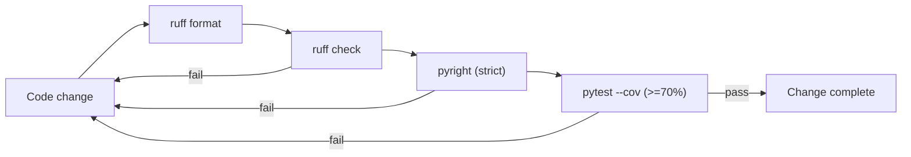

# ADR 0001: Code Maintainability and Quality Gates

- Status: Proposed
- Date: 2026-09-24
- Deciders: Project maintainer

This ADR establishes the non-negotiable quality gates for the project: automated tests, a minimum test-coverage floor, and enforced linting, formatting, and type checking. It exists so that code moving out of exploratory notebooks and into the installable `anyprec` package cannot silently regress. It is adapted from the E2E_RAG project's ADR 0001, with changes for a numerical, tensor-heavy codebase.

## Context

This project reproduces, at small scale, the any-precision quantization method of Park et al. (ICML 2024) on IBM Granite 4.0 350M, implemented from scratch in PyTorch. Work begins in notebooks and is refined into a structured Python package (`src/anyprec`) with entry scripts for quantization and evaluation (layout in [ADR 0002](0002-project-layout-and-architecture.md)).

Numerical code fails quietly. An off-by-one in a prefix-sum segment, a wrong shift in a nested index, or a dtype downcast produces a model that still runs and still emits text, only worse. Tests are therefore the primary defence, and they must check mathematical invariants rather than merely exercise code paths.

The reference implementation cloned at `any-precision-llm/` is read-only material. It is not part of the package and is excluded from every gate below.

## Decision

We adopt four mandatory gates. All four must pass locally before any change is considered complete, and they are the reference for any future CI pipeline.

### 1. Automated unit tests (pytest)

Every behavioral change ships with tests. Tests live under [tests/](../../tests) and mirror the package layout, and they are discovered via `testpaths = ["tests"]` and `pythonpath = ["src"]`.

- Test names state the scenario and expected outcome, e.g. `test_upscaled_indices_reduce_to_seed_indices_by_right_shift`.
- Each test carries a Behavior-Driven-Development docstring structured as Given / When / Then.
- Heavy or external components are never hit by the default suite. There is no adapter layer ([ADR 0002](0002-project-layout-and-architecture.md) uses Hugging Face directly), so the seam is the model and data *objects* themselves:
  - Models: tests build a tiny, randomly initialised `GraniteMoeHybridForCausalLM` from an in-code `GraniteMoeHybridConfig` (for example 2 layers, hidden size 64). This exercises the real module tree and module names without a download.
  - Data: tests pass small in-memory lists of strings or `datasets.Dataset.from_dict(...)` objects to functions that accept already-loaded text.
- Numerical kernels (weighted 1D k-means, segment splitting, index packing, Hadamard construction) are tested with **property-based tests** (hypothesis) against brute-force or float64 reference implementations on small inputs. Floating-point comparisons always state explicit `atol`/`rtol`.
- Every test is independent and reproducible: no shared mutable global state, seeded RNGs (`torch.Generator`, `numpy.random.Generator`), and no reliance on wall-clock time.
- Markers gate expensive tests; the default `addopts = "-m 'not gpu and not slow and not network'"` keeps the everyday suite fast and offline.

| Marker | Meaning |
| --- | --- |
| `gpu` | Requires a CUDA device |
| `slow` | Long-running quantization or evaluation jobs |
| `network` | Downloads from the Hugging Face Hub (models or datasets); opt-in via `-m network` |

### 2. Minimum 70% test coverage

Line coverage must be at least 70% for the `anyprec` package, enforced with `pytest-cov`:

```bash
pytest --cov=anyprec --cov-report=term-missing --cov-fail-under=70
```

The 70% floor is a pragmatic minimum, not a target. The quantization core (Fisher accumulation, k-means, upscaling, nested indexing, simulated inference, bits-per-weight accounting) is expected to sit well above it. Thin wrappers around `from_pretrained` or `load_dataset` are not padded with low-value pass-through tests to inflate the number.

### 3. Linting and formatting (Ruff)

Ruff is the single tool for both linting and formatting, configured in [pyproject.toml](../../pyproject.toml). Its rule set is `E, F, I, UP, B, SIM, RUF` at `line-length = 100`, targeting `py313`. `E501` is ignored because tensor-shape comments are long; the formatter handles code width.

```bash
ruff check .          # lint
ruff format .         # format
ruff check --fix .    # apply safe autofixes
```

### 4. Strict static type checking (Pyright)

Pyright runs in `strict` mode over `src`, `quantization`, `evaluation`, and `tests`. Explicit type hints are required; catch-all types (`Any`) are avoided unless a boundary genuinely demands them.

```bash
pyright
```

PyTorch, `transformers`, `datasets`, and `lm-eval` are only partially typed. Where strict mode cannot see through a library return type, narrow it once at the boundary with `typing.cast` or an `isinstance` check and a short comment, rather than letting `Any` propagate inward. `reportMissingTypeStubs = false` remains set.

### 5. Notebook integrity

Notebooks under [notebooks/](../../notebooks) are exploratory, but they must remain valid artifacts.

- They preserve nbformat v4 validity, checked with `nbformat.validate` after edits.
- `metadata.language_info` matches the project interpreter (Python 3.13).
- Stale or corrupted outputs are cleared rather than preserved.
- Logic that stabilises in a notebook moves into `src/anyprec` with tests; notebooks then import it.

## Tooling summary

The table below is the canonical mapping of concern to tool and command.

| Concern | Tool | Command | Enforced by |
| --- | --- | --- | --- |
| Unit testing | pytest | `pytest` | `[tool.pytest.ini_options]` |
| Coverage floor (>=70%) | pytest-cov | `pytest --cov=anyprec --cov-fail-under=70` | this ADR |
| Property tests | hypothesis | used within pytest | test authorship |
| Lint | ruff | `ruff check .` | `[tool.ruff.lint]` |
| Format | ruff | `ruff format .` | `[tool.ruff]` |
| Types | pyright | `pyright` | `[tool.pyright]` |
| Notebook validity | nbformat | `python -c "import nbformat; ..."` | this ADR |

All tools exclude `any-precision-llm/` (the read-only reference clone), `outputs/`, and caches.

## Local verification loop

The required order of operations before finalizing a change is format, lint, type-check, then test with coverage. Any failure is analyzed and fixed before re-running until the loop passes cleanly.



*The loop is iterative: any red gate sends the change back for correction.*

## Consequences

The upside is a codebase that stays refactor-safe and whose numerical claims are backed by invariant tests. The cost is real but accepted.

- Positive: silent numerical regressions are caught by property tests; the default suite runs offline and without a GPU; style and typing are uniform.
- Negative: every change carries test and typing overhead; strict Pyright is noisy around PyTorch and Hugging Face APIs, mitigated by boundary casts.
- Follow-up: encode `--cov-fail-under=70` into `addopts` once the package has enough surface; wire these gates into CI if a pipeline is introduced.
