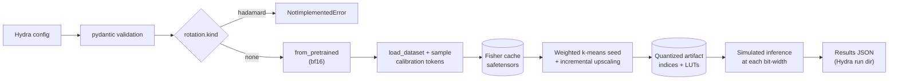

# ADR 0002: Project Layout and Core Architecture

- Status: Proposed
- Date: 2026-09-24
- Deciders: Project maintainer

This ADR fixes the repository layout, the environment, how models and datasets are loaded (Hugging Face directly, no adapter layer), how configuration flows from Hydra into validated Python objects, and how intermediate artifacts are cached. The methodology itself is in [ADR 0003](0003-fisher-weighted-kmeans-methodology.md).

## Context

The goal is a small-scale, from-scratch PyTorch reproduction of any-precision quantization (Park et al., ICML 2024) on `ibm-granite/granite-4.0-350m`, judged on answer quality rather than latency. The project follows the conventions of the maintainer's E2E_RAG project: notebooks for exploration, a `src/` package for refined code, Hydra for configuration, Conda for the environment, and `pyproject.toml` for package metadata and tool configuration.

Two scoping decisions shape the architecture:

- **Hugging Face only.** Models come from the Hugging Face Hub through `transformers`, and datasets through `datasets`. We deliberately do not introduce model or dataset adapter protocols. What varies between models (the model ID and which linear layers to quantize) is expressed as configuration, not as code.
- **Quality, not latency.** Quantized weights are dequantized back into ordinary `nn.Linear` modules for evaluation ([ADR 0005](0005-artifact-format-and-simulated-inference.md)). No custom CUDA kernel or bitplane layout is built.

### Target model facts

The following facts about `granite-4.0-350m` were verified against its `config.json` and against `transformers` 5.17.0 (`models/granitemoehybrid/modeling_granitemoehybrid.py`).

| Property | Value |
| --- | --- |
| Architecture class | `GraniteMoeHybridForCausalLM` (`model_type: granitemoehybrid`) |
| Layers | 28, all `attention` (no Mamba layers; `num_local_experts: 0`) |
| Hidden size / MLP size | 1024 / 2048 |
| Attention heads / KV heads | 16 / 4 (head dim 64) |
| Vocabulary, tied embeddings | 100,352, `tie_word_embeddings: true` |
| Checkpoint dtype | bfloat16 |

Quantizable linear layers per decoder block, as `[out_features, in_features]`:

| Module | Shape | Parameters |
| --- | --- | --- |
| `self_attn.q_proj` | [1024, 1024] | 1.05M |
| `self_attn.k_proj` | [256, 1024] | 0.26M |
| `self_attn.v_proj` | [256, 1024] | 0.26M |
| `self_attn.o_proj` | [1024, 1024] | 1.05M |
| `shared_mlp.input_linear` | [4096, 1024] (gate and up fused) | 4.19M |
| `shared_mlp.output_linear` | [1024, 2048] | 2.10M |

That is about 8.9M parameters per block and 249M across 28 blocks. The tied embedding and LM head (about 103M parameters, roughly 29% of the model) are **not quantized** and stay in their original precision; [ADR 0004](0004-evaluation-protocol.md) requires this to be reported.

## Decision

### Repository layout

```
AnyPrecisionLLM/
├── any-precision-llm/            # read-only reference clone (SNU-ARC); excluded from all tooling
├── configs/                      # Hydra configuration (see below)
│   ├── quantize.yaml             # primary config for the quantization entry script
│   ├── evaluate.yaml             # primary config for the evaluation entry script
│   ├── model/granite_4_0_350m.yaml
│   ├── calibration/c4.yaml
│   ├── quantizer/kmeans_iu.yaml
│   ├── rotation/{none,hadamard}.yaml
│   ├── eval/{default.yaml,prompts.yaml}
│   └── judge/{default.yaml,prompts/}   # LLM-as-a-judge (ADR 0007)
├── docs/adr/                     # this directory
├── notebooks/                    # exploration; imports anyprec once logic stabilises
├── quantization/                 # entry script(s): quantize_any_precision.py
├── evaluation/                   # entry script(s): evaluate_any_precision.py
├── src/anyprec/
│   ├── config/                   # pydantic schemas mirroring the Hydra groups
│   ├── data/                     # calibration sampling and evaluation text loading
│   ├── models/                   # from_pretrained wrapper, quantizable-module discovery
│   ├── sensitivity/              # empirical Fisher accumulation (ADR 0003)
│   ├── quantization/             # weighted 1D k-means, upscaling, pipeline (ADR 0003)
│   ├── rotation/                 # Hadamard rotation (ADR 0006; raises for now)
│   ├── artifacts/                # safetensors store, manifest, cache keys (ADR 0005)
│   ├── inference/                # simulated inference: set precision on a model (ADR 0005)
│   ├── evaluation/               # perplexity, KL, lm-eval, generations, bits/weight (ADR 0004)
│   ├── judge/                    # LLM-as-a-judge: ported endpoint pool + SQLite store (ADR 0007)
│   └── utils/                    # logging, seeding, hashing
├── tests/                        # mirrors src/anyprec
├── outputs/                      # gitignored: Hydra run dirs, cache, results
├── environment.yaml
├── pyproject.toml
└── env.template                  # judge endpoint variables (ADR 0007); Granite itself needs no secrets
```

Entry scripts are thin: they compose the Hydra config, validate it into pydantic, and call a single function in `anyprec`. This mirrors E2E_RAG's `training/` and `data_synthesis/` directories.

### Environment

The environment mirrors E2E_RAG: Python 3.13, `conda-forge` as the only Conda channel, and CUDA-enabled PyTorch installed from the PyTorch cu126 pip index (the local driver exposes CUDA 12.6). The `pyproject.toml` declares dependencies for metadata and editable installs; Conda remains responsible for resolution.

| Dependency | Purpose |
| --- | --- |
| `torch>=2.9,<2.10` (cu126 wheel) | Tensors, autograd, `register_post_accumulate_grad_hook` |
| `transformers>=5.17` | `GraniteMoeHybridForCausalLM` (verified present in 5.17.0) |
| `datasets` | C4, WikiText-2 |
| `safetensors` | Artifact storage (ADR 0005) |
| `accelerate` | `device_map` support in `from_pretrained` |
| `hydra-core`, `pydantic>=2.6` | Configuration and validation |
| `lm-eval` | Zero-shot tasks (ADR 0004) |
| `openai`, `python-dotenv`, `Jinja2` | Judge endpoint client, credentials, prompt templates (ADR 0007) |
| `numpy`, `matplotlib`, `tabulate`, `tqdm`, `ipykernel`, `ipywidgets`, `nbformat` | Notebooks, plotting, and aligned text tables |
| `pytest`, `pytest-cov`, `hypothesis`, `ruff`, `pyright` | Quality gates (ADR 0001) |

The reference implementation's own dependencies (`numba`, `flash1dkmeans`, the CUDA extension) are **not** adopted; ADR 0003 implements the algorithm in PyTorch.

### Loading models: Hugging Face directly

Models are loaded with `AutoModelForCausalLM.from_pretrained` and `AutoTokenizer.from_pretrained`. The model config group supplies everything that varies per model:

```yaml
# configs/model/granite_4_0_350m.yaml
model_id: ibm-granite/granite-4.0-350m
revision: bd8a1497065c0d6ba1ef19af6b0d2b14bacf71c2   # Hub commit of 2025-10-23
dtype: bfloat16           # dtype used for Fisher estimation
eval_dtype: float32       # dtype used for simulated inference and evaluation (ADR 0005)
quantizable_modules:
  # Regular expression matched against fully-qualified module names from named_modules().
  pattern: '^model\.layers\.\d+\.(self_attn\.(q|k|v|o)_proj|shared_mlp\.(input|output)_linear)$'
  expected_count: 168     # 28 layers x 6 linears; a mismatch is a hard error
```

Quantizable-module discovery walks `model.named_modules()`, keeps `nn.Linear` instances whose name matches `pattern`, and fails if the count differs from `expected_count`. The count check turns a silent mis-configuration (a renamed module in a future `transformers` release, or a different architecture) into an immediate error. `lm_head` and `model.embed_tokens` never match the pattern.

Pinning `revision` makes a run reproducible against a fixed checkpoint. It is part of the cache key.

### Loading datasets: Hugging Face directly

Datasets are loaded with `datasets.load_dataset`. The calibration group specifies the source and the sampling rule:

```yaml
# configs/calibration/c4.yaml
path: allenai/c4
data_files: {train: en/c4-train.00000-of-01024.json.gz}
split: train
text_field: text
num_sequences: 100
seq_len: 512
seed: 0
```

Calibration sampling follows the reference implementation's `_sample_and_tokenize` rule: draw documents uniformly at random without replacement using a seeded generator, tokenize each, skip documents shorter than `seq_len` tokens, and keep the first `seq_len` tokens of each accepted document. No BOS/EOS or chat template is added; calibration uses raw text even though the model is instruction-tuned (a chat-formatted variant is future work).

Evaluation text (WikiText-2 test, C4 validation) is loaded the same way and specified in the eval group ([ADR 0004](0004-evaluation-protocol.md)). WikiText-2 is loaded from `Salesforce/wikitext` with config `wikitext-2-raw-v1`.

Functions that consume text accept already-loaded Python objects (a `Sequence[str]` or a `datasets.Dataset`), so tests can pass in-memory data without the network (ADR 0001).

### Configuration: Hydra composed, pydantic validated

Hydra composes the configuration from groups; the entry script converts it with `OmegaConf.to_container(cfg, resolve=True)` and validates it into a frozen pydantic model. All code below the entry script receives pydantic objects, never `DictConfig`.

```yaml
# configs/quantize.yaml
defaults:
  - model: granite_4_0_350m
  - calibration: c4
  - quantizer: kmeans_iu
  - rotation: none
  - _self_

seed: 0                   # seeds random, NumPy, and PyTorch at the start of the run
device: cuda              # "cuda", "cuda:0", or "cpu"; CUDA without a GPU is an error, never a silent fallback

output:
  base_dir: outputs
  cache_dir: ${output.base_dir}/cache

hydra:
  job:
    chdir: false
  run:
    dir: ${output.base_dir}/quantize/${now:%Y-%m-%d}/${now:%H-%M-%S}
```

`configs/evaluate.yaml` composes the same `model`, `calibration`, `quantizer`, and `rotation` groups, which it needs to recompute the keys of the artifacts it evaluates, plus the `eval` group. It has the same `seed`, `device`, and `output` keys, and one more:

```yaml
modes: [incremental, standalone]   # which quantized artifacts to evaluate; each must already exist
```

Discriminated unions (`kind: Literal[...]`) are used where a group has alternatives, notably `rotation` ([ADR 0006](0006-hadamard-rotation.md)). The pydantic schemas are also the single source of truth for test fixtures, which prevents fixture drift.

### Pipeline and data flow



*Database-shaped nodes are cached artifacts keyed by configuration hash; re-running evaluation never recomputes them.*

### Caching and artifact identity

Expensive intermediate results are cached under `outputs/cache/` and keyed by a SHA-256 hash of the canonical JSON of exactly the configuration subtrees they depend on, plus an artifact schema version.

| Artifact | Key depends on |
| --- | --- |
| Fisher diagonals | `model.model_id`, `model.revision`, `model.dtype`, `calibration.*`, `rotation.*` |
| Quantized artifact | Fisher key, `quantizer.*` |
| Evaluation results | Not cached; written to the Hydra run directory with a copy of the resolved config |

`device` is deliberately not part of any key. It does not change what an artifact means, but k-means++ draws differ between CPU and CUDA generators, so each manifest records the device type that produced it ([ADR 0005](0005-artifact-format-and-simulated-inference.md)).

A cache hit is only accepted if the stored manifest's config snapshot matches the requested one; otherwise the run fails rather than silently reusing mismatched data. Formats are specified in [ADR 0005](0005-artifact-format-and-simulated-inference.md).

### Reproducibility

Every entry script seeds Python's `random`, NumPy, and PyTorch from the top-level `seed`, logs the resolved config, the package version, the `transformers` and `torch` versions, and the model revision, and writes them into every manifest and results file.

## Consequences

The architecture stays small: configuration expresses what varies between models and datasets, and code expresses the method.

- Positive: adding another Hugging Face causal LM is a new YAML file (model ID, module pattern, expected count); cached Fisher and quantized artifacts make evaluation iterations cheap; the count check guards against silent module mismatches.
- Negative: without adapters, non-Hugging-Face models are out of reach until a later ADR revisits this; the module regex is architecture-specific and must be written per model.
- Risk (partially retired): the `AnyPrecLLM` environment resolves `lm-eval` 0.4.13 alongside `transformers` 5.17.0, and `lm_eval.models.huggingface.HFLM` imports cleanly. An end-to-end task run has not been verified yet. If one fails, ADR 0004 falls back to a minimal in-house log-likelihood scorer for the chosen tasks.
- Out of scope: the hybrid `granite-4.0-h-350m` (Mamba-2 layers add `mamba.in_proj` and `mamba.out_proj` and different sensitivity behaviour), non-Hugging-Face sources, and any latency measurement.
