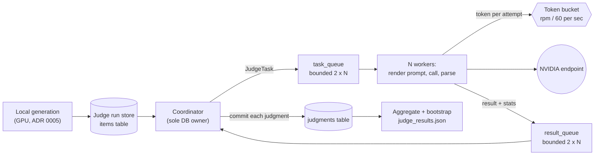

# ADR 0007: LLM-as-a-Judge Evaluation of Answer Quality

- Status: Proposed
- Date: 2026-09-24
- Deciders: Project maintainer

This ADR adds a judged-quality metric to the evaluation protocol of [ADR 0004](0004-evaluation-protocol.md): a strong remote LLM compares each quantized model's answer against the unquantized model's answer to the same prompt. It fixes the judging protocol (blind pairwise comparison in both orderings, plus an absolute score), the statistics reported, and the execution machinery, which is ported from the E2E_RAG project's parallel, rate-limited, SQLite-checkpointed synthesis pipeline.

## Context

ADR 0004's metrics measure how far the quantized model's *distribution* moves (KL divergence, top-1 agreement, perplexity) and how it scores on multiple-choice tasks. None of them asks the question a user asks: is this answer still as good? A small KL divergence can hide a changed fact, and a noticeable KL divergence can leave the answer equally useful. ADR 0004 left LLM-as-a-judge as a follow-up; this ADR adopts it.

Judging is network-bound and long-running. With 200 prompts, 6 bit-widths, 2 quantizer modes, and 2 orderings per comparison, a full sweep is up to 4,800 judge requests; at a 40-requests-per-minute endpoint limit that is about two hours. The run must therefore overlap requests, respect the rate limit, survive crashes and resume, and never pay twice for the same judgment.

The E2E_RAG project already solves this for dataset synthesis against NVIDIA's OpenAI-compatible endpoint (`https://integrate.api.nvidia.com/v1`), in its ADR 0003 (resumable SQLite run store) and ADR 0004 (parallel coordinator/worker pool with a token bucket). Inspection of its source shows two kinds of code:

| Component (E2E_RAG `src/e2e_rag/utils/synthesize_datasets/temporal/`) | Task-agnostic? |
| --- | --- |
| `adapters.py`: `ChatCompletionsAdapter`, `OpenAIChatCompletionsAdapter` | Yes |
| `rate_limit.py`: `TokenBucket` | Yes |
| `schemas.py`: `OpenAIEndpointConfig`, `ParallelismConfig`, `RetriesExhaustedError` | Yes |
| `synthesizer.py`: retry loop with exponential backoff and jitter, error classification | Pattern is generic; code is coupled to template batches |
| `parallel.py`: coordinator, workers, `ReservationLedger` | Pattern is generic; code is coupled to template quotas |
| `sqlite_store.py`, `checkpoint.py`: run store, `TemplateCheckpoint` | Pattern is generic; schema is template-specific |

## Decision

### Reuse strategy: port, do not depend

The task-agnostic modules are **ported** (copied) into `src/anyprec/judge/`, with a module docstring naming the E2E_RAG source file and the commit or date it was copied from. There is no cross-repository import and no editable install of E2E_RAG. The judge-specific coordinator, worker body, and SQLite store are **written new**, following E2E_RAG ADR 0003 and ADR 0004's design (single-writer coordinator, bounded queues, token acquired before every attempt, per-transaction checkpoints, status-driven resume), but with a schema and ledger shaped for judgments instead of templates.

| Module in `anyprec.judge` | Origin |
| --- | --- |
| `endpoint.py` (`ChatCompletionsAdapter`, `OpenAIChatCompletionsAdapter`, `OpenAIEndpointConfig`) | Ported from E2E_RAG `adapters.py` and `schemas.py` |
| `rate_limit.py` (`TokenBucket`) | Ported from E2E_RAG `rate_limit.py` |
| `config.py` (`ParallelismConfig`, `RetryConfig`, `JudgeConfig`) | `ParallelismConfig` ported; the rest new |
| `schemas.py` (`JudgeItem`, `JudgeTask`, `JudgeVerdict`, results) | New |
| `retry.py` (backoff loop, retryable/fatal classification) | New, same semantics as E2E_RAG `synthesizer.py` |
| `parallel.py` (coordinator and workers) | New, same topology as E2E_RAG ADR 0004 |
| `store.py` (per-run SQLite store) | New, same lifecycle as E2E_RAG ADR 0003 |
| `aggregate.py` (win rates, scores, bootstrap intervals) | New |

Ported code is frozen at copy time. Improvements made later in E2E_RAG are not picked up automatically; that is the accepted cost of avoiding a cross-project dependency.

### What is judged

**Prompt set.** Judging needs far more prompts than ADR 0004's 20 qualitative prompts to give usable confidence intervals. The default is 200 prompts from the `test` split of `HuggingFaceH4/no_robots` (500 human-written instructions with a `category` field, loadable as plain parquet), sampled with a fixed seed and stratified by `category` so that every category is represented in proportion. Only the first user turn (`prompt`) is used. The source, split, count, and seed are configuration.

**Answers.** For each prompt, the reference answer comes from the unquantized model and each candidate answer from the quantized model at bit-width $b$ and mode $m$ (`incremental` or `standalone`). All answers are produced as in ADR 0004 Metric 4: the chat template is applied and decoding is greedy, with `max_new_tokens` raised to 256 for this set so that answers are rarely truncated. Answers are generated locally in a separate step and saved before any judge call, so judging never touches the GPU.

**Judged unit.** An *item* is one tuple (prompt, reference answer, candidate answer, $m$, $b$). Each item produces two *tasks*, one per ordering:

| Ordering | Assistant A | Assistant B |
| --- | --- | --- |
| `ref_first` | reference | candidate |
| `cand_first` | candidate | reference |

The judge is **blind**: it sees only "Assistant A" and "Assistant B", never which answer is quantized or at what bit-width.

**Identical answers are not sent.** Greedy decoding at high bit-widths often reproduces the reference answer exactly. When the candidate text equals the reference text byte for byte, the item is recorded as `identical`, which counts as a tie, and no request is made. This is correct by definition and substantially reduces the number of calls at 6 to 8 bits.

**Controls.** Two control conditions run through the same pipeline:

- An *identity control*, the reference answer against itself for a random 10% of prompts, forced through the judge (bypassing the identical-text shortcut). This measures how often the judge declares a winner between identical answers, which is a floor on judge noise.
- A *self-consistency control*, re-judging a random 5% of tasks a second time, which measures run-to-run agreement at the configured temperature.

### Judge prompt and structured output

The system and user prompts are Jinja2 templates under `configs/judge/prompts/`, as in E2E_RAG. The rubric asks the judge to consider correctness, helpfulness, instruction following, and clarity; to ignore answer length except where it affects those; and not to favour either position. The judge returns JSON validated against this pydantic schema, requested with the endpoint's `json_schema` structured-output mode:

```python
class JudgeVerdict(BaseModel):
    model_config = ConfigDict(extra="forbid", frozen=True)

    rationale: str = Field(min_length=1, max_length=2000)   # written first, before the verdict
    score_a: int = Field(ge=1, le=10)
    score_b: int = Field(ge=1, le=10)
    verdict: Literal["A", "B", "tie"]
```

The rationale field comes first so the judge reasons before committing to a verdict. A response that fails to parse or validate is a retryable failure, and its raw text is kept in the store for inspection.

Sampling uses `temperature: 0.0` and a fixed `seed` where the endpoint supports it. The judge model is read from the environment (`JUDGE_MODEL`), separately from any model E2E_RAG uses, and should be substantially stronger than Granite-350M.

### Combining the two orderings

Let $v_{\mathrm{rf}}$ and $v_{\mathrm{cf}}$, each in $\lbrace A, B, \mathrm{tie}\rbrace$, be the verdicts of the `ref_first` and `cand_first` orderings. Map each to the candidate's outcome, $o \in \lbrace +1, 0, -1\rbrace$ for win, tie, and loss:

$$
o_{\mathrm{rf}} = \begin{cases} +1 & v_{\mathrm{rf}} = B \\ 0 & v_{\mathrm{rf}} = \mathrm{tie} \\ -1 & v_{\mathrm{rf}} = A \end{cases}
\qquad
o_{\mathrm{cf}} = \begin{cases} +1 & v_{\mathrm{cf}} = A \\ 0 & v_{\mathrm{cf}} = \mathrm{tie} \\ -1 & v_{\mathrm{cf}} = B \end{cases}
$$

The item's outcome is $o_{\mathrm{rf}}$ if the two outcomes agree, and $0$ (tie) if they disagree. A disagreement is a *position-inconsistent* item; its rate is reported. The item's candidate score and reference score are each the mean over the two orderings, and the item's score difference is $\Delta s = \bar s_{\mathrm{cand}} - \bar s_{\mathrm{ref}}$. Identical items have $o = 0$ and $\Delta s = 0$.

### Reported statistics

For each mode $m$ and bit-width $b$, over the $P$ judged prompts:

| Statistic | Definition |
| --- | --- |
| Win / tie / loss rate | Fractions of items with $o = +1, 0, -1$ |
| Non-inferiority rate | Fraction with $o \ge 0$: the candidate was not judged worse than the reference |
| Net preference | $\bar o = \frac{1}{P}\sum_i o_i \in [-1, 1]$; 0 means indistinguishable from the reference |
| Mean score difference | $\overline{\Delta s}$ on the 1 to 10 scale |
| Position-inconsistency rate | Fraction of items whose two orderings disagreed |
| Identical rate | Fraction of items skipped because candidate equals reference |
| Identity-control win rate | Fraction of identity controls where the judge did not say tie |
| Self-consistency | Agreement rate between repeated judgments of the same task |

Net preference, non-inferiority, and mean score difference carry 95% percentile-bootstrap confidence intervals, resampling prompts with replacement ($10{,}000$ resamples, fixed seed). Resampling by prompt, not by task, keeps the two orderings of an item together. Results per category are reported alongside the totals.

Expected shape: net preference near 0 at 6 to 8 bits, becoming negative at 3 to 4 bits, with the gap between `incremental` and `standalone` small, mirroring the paper's perplexity results (its Table 3). A judge whose identity-control win rate is high cannot resolve differences that small, and results from it are treated as inconclusive.

### Execution architecture



*Generation and judging are separate phases, so a judge run never needs the GPU and a crash during judging never re-generates answers.*

**Coordinator and workers.** The topology, queue sizing, token bucket, backoff with per-worker `random.Random` jitter, shared HTTP client with a connection pool of at least `num_workers`, no-progress guard, coordinated shutdown, and per-worker statistics are exactly those of E2E_RAG ADR 0004. The only structural change is the ledger. There are no quotas; the work list is the set of task keys not yet in `judgments`, and the ledger tracks `pending`, `in_flight`, and `done` task keys. A task is enqueued at most once per run, so duplicates cannot occur.

**Error classes** are the same as E2E_RAG ADR 0004: `429`, `5xx`, timeouts, transport errors, and unparseable or schema-invalid responses are retryable with exponential backoff; `400`, `401`, and `403` are fatal and trigger coordinated shutdown.

**Store.** One SQLite file per judge run at `outputs/judge/runs/<run_id>.sqlite`, opened with `journal_mode=WAL` and `foreign_keys=ON`, schema versioned with `PRAGMA user_version`:

```sql
CREATE TABLE runs (
    run_id           TEXT PRIMARY KEY,
    status           TEXT NOT NULL CHECK (status IN ('items_written', 'judging', 'completed')),
    config_snapshot  TEXT NOT NULL,
    config_hash      TEXT NOT NULL,     -- identity: judge model, prompts, sampling, item source
    created_at       TEXT NOT NULL,
    updated_at       TEXT NOT NULL,
    completed_at     TEXT
);

CREATE TABLE items (
    item_id          TEXT PRIMARY KEY,  -- SHA-256(prompt_id | mode | bits | artifact_hash)
    prompt_id        TEXT NOT NULL,
    category         TEXT NOT NULL,
    prompt_text      TEXT NOT NULL,
    reference_text   TEXT NOT NULL,
    candidate_text   TEXT NOT NULL,
    mode             TEXT NOT NULL,     -- incremental | standalone | identity_control
    bits             INTEGER,           -- NULL for identity controls
    artifact_hash    TEXT NOT NULL,
    is_identical     INTEGER NOT NULL CHECK (is_identical IN (0, 1))
);

CREATE TABLE judgments (
    task_key         TEXT PRIMARY KEY,  -- SHA-256(item_id | ordering | repeat)
    item_id          TEXT NOT NULL REFERENCES items(item_id),
    ordering         TEXT NOT NULL CHECK (ordering IN ('ref_first', 'cand_first')),
    repeat           INTEGER NOT NULL DEFAULT 0,   -- 1 for self-consistency re-judgments
    verdict          TEXT NOT NULL CHECK (verdict IN ('A', 'B', 'tie')),
    score_a          INTEGER NOT NULL CHECK (score_a BETWEEN 1 AND 10),
    score_b          INTEGER NOT NULL CHECK (score_b BETWEEN 1 AND 10),
    rationale        TEXT NOT NULL,
    raw_response     TEXT NOT NULL,
    created_at       TEXT NOT NULL
);

CREATE TABLE invalid_payloads (
    id               INTEGER PRIMARY KEY,
    task_key         TEXT NOT NULL,
    payload_text     TEXT NOT NULL,
    error_text       TEXT NOT NULL,
    created_at       TEXT NOT NULL
);
```

**Lifecycle and resume.** Status advances `items_written` → `judging` → `completed`. On resume, the run's config hash is recomputed and any difference hard-fails, naming the diverging keys. The hash covers the judge model, the prompt templates, sampling settings, and the item source (prompt set and artifact hashes); it excludes `parallelism` and retry settings, so throughput can be re-tuned on resume, as in E2E_RAG ADR 0003. The coordinator enqueues only task keys absent from `judgments`, so a crash loses at most the in-flight requests. Aggregation always reads from the store, so `judge_results.json` can be regenerated from a completed run at any time.

### Configuration

```yaml
# configs/judge/default.yaml
prompts:
  path: HuggingFaceH4/no_robots
  split: test
  text_field: prompt
  category_field: category
  num_prompts: 200
  seed: 0
generation:
  max_new_tokens: 256
controls:
  identity_fraction: 0.10
  self_consistency_fraction: 0.05
endpoint:
  base_url: ${oc.env:NVIDIA_BASE_URL,https://integrate.api.nvidia.com/v1}
  model: ${oc.env:JUDGE_MODEL}
  api_key_env: NVIDIA_API_KEY
  timeout_seconds: 180.0
  temperature: 0.0
  seed: 0
templates:
  system: configs/judge/prompts/judge_system.jinja2
  user: configs/judge/prompts/judge_user.jinja2
retry:
  max_retries: 10
  initial_backoff_seconds: 1.0
  max_backoff_seconds: 90.0
  backoff_multiplier: 2.0
  jitter_fraction: 0.2
parallelism:
  num_workers: 4
  requests_per_minute: 40
  max_burst: null
  initial_tokens: 1
  task_queue_maxsize: null
  result_queue_maxsize: null
  no_progress_limit: 50
bootstrap:
  resamples: 10000
  seed: 0
output:
  runs_dir: outputs/judge/runs
  resume_run_id: null
```

Credentials live in a gitignored `.env` (`NVIDIA_API_KEY`, `NVIDIA_BASE_URL`, `JUDGE_MODEL`), loaded with `python-dotenv`, with an `env.template` checked in. Only the *name* of the key's environment variable appears in configuration.

### Testing

Per [ADR 0001](0001-code-maintainability.md), the default suite never calls the endpoint. Tests drive the coordinator with fake `ChatCompletionsAdapter` implementations (scripted verdicts, scripted `429`s and malformed JSON, and a scripted fatal `401`) and an injected clock and sleep for the token bucket. Invariants to test include: ordering combination and the disagreement-to-tie rule; identical items never produce a request; resume enqueues exactly the missing task keys; a config-hash mismatch hard-fails; the bootstrap resamples by prompt. A single `network`-marked smoke test issues one real judge request.

## Consequences

The project gains a human-meaningful quality metric that complements the distributional metrics of ADR 0004, run on proven infrastructure.

- Positive: blind, order-swapped judging removes the most common judge bias; identical-text skipping and resumable storage keep cost bounded; controls quantify judge noise instead of assuming it away; the E2E_RAG design is reused without coupling the two projects.
- Negative: judge verdicts depend on the judge model and prompt, so results are comparable only within a fixed judge configuration (enforced by the config hash); ported modules can drift from their E2E_RAG originals; a full sweep takes hours at typical rate limits and costs endpoint credits.
- Known biases not fully removed: verbosity preference (mitigated by the rubric; answer-length differences are reported per item so it can be checked) and the judge's own knowledge limits on factual prompts.
- Out of scope: multi-turn judging (MT-Bench style), human evaluation, and using judge scores as a quantization objective.
