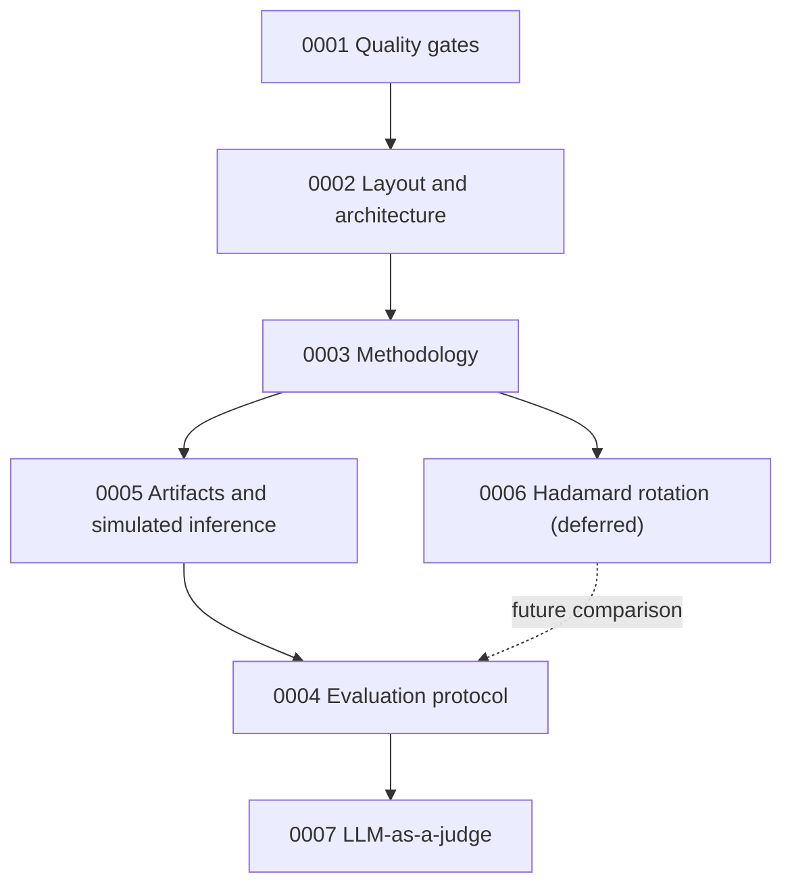

# Architecture Decision Records

This directory holds the project's Architecture Decision Records (ADRs). An ADR captures a single significant decision, its context, and its consequences, so that the reasoning behind the codebase is not lost across time or chat sessions. ADRs are the single source of truth for architecture; when an implementation detail is ambiguous, consult these first, and if they are insufficient, resolve the question with the maintainer and record the answer here.

## Project in one paragraph

This project is a small-scale, from-scratch PyTorch reproduction of Park et al., "Any-Precision LLM: Low-Cost Deployment of Multiple, Different-Sized LLMs" (ICML 2024), applied to `ibm-granite/granite-4.0-350m`. A single 8-bit parent model is built by Fisher-weighted k-means at 3 bits followed by incremental upscaling, so that every bit-width from 3 to 8 is available by keeping the top bits of each weight's index. The focus is answer quality, not latency: quantized weights are dequantized into the standard Hugging Face model and evaluated against the original. The upstream implementation is cloned read-only at `any-precision-llm/` for reference.

## Conventions

Records are numbered sequentially and named `NNNN-short-title.md`. Each follows the same skeleton: Status, Date, Context, Decision, Consequences. A decision that overturns an earlier one supersedes it rather than editing history, and both records note the relationship.

Status values used in this project:

| Status | Meaning |
| --- | --- |
| Proposed | Under discussion, not yet adopted |
| Accepted | Adopted and in force |
| Superseded | Replaced by a later ADR (which is referenced) |
| Deprecated | No longer relevant, not replaced |

## Index

| ADR | Title | Status |
| --- | --- | --- |
| [0001](0001-code-maintainability.md) | Code Maintainability and Quality Gates | Proposed |
| [0002](0002-project-layout-and-architecture.md) | Project Layout and Core Architecture | Proposed |
| [0003](0003-fisher-weighted-kmeans-methodology.md) | Methodology: Fisher-Weighted k-Means with Incremental Upscaling | Proposed |
| [0004](0004-evaluation-protocol.md) | Evaluation Protocol for Answer Quality | Proposed |
| [0005](0005-artifact-format-and-simulated-inference.md) | Quantized Artifact Format and Simulated Inference | Proposed |
| [0006](0006-hadamard-rotation.md) | Hadamard Rotation Before Clustering (Opt-In, Deferred) | Proposed |
| [0007](0007-llm-as-judge-evaluation.md) | LLM-as-a-Judge Evaluation of Answer Quality | Proposed |

## How the records relate

*Each arrow points from a record to one that builds on its terms.*
