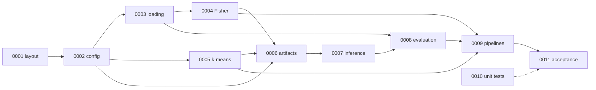

# Wave 0: Package Core, Quantization Pipeline, and First Evaluation

- Status: Proposed
- Date: 2026-09-25
- Related ADRs: [0001](../../adr/0001-code-maintainability.md), [0002](../../adr/0002-project-layout-and-architecture.md), [0003](../../adr/0003-fisher-weighted-kmeans-methodology.md), [0004](../../adr/0004-evaluation-protocol.md), [0005](../../adr/0005-artifact-format-and-simulated-inference.md), [0006](../../adr/0006-hadamard-rotation.md)

Wave 0 turns the prototypes in [notebooks/02_Fisher_and_KMeans.ipynb](../../../notebooks/02_Fisher_and_KMeans.ipynb) into the installable `anyprec` package. It adds two Hydra entry scripts: one quantizes all 168 Granite linears into an any-precision artifact, and the other measures KL divergence, top-1 agreement, perplexity, and bits per weight at 3 to 8 bits.

## Scope

The wave covers everything from configuration to the first quality numbers, and stops before the heavier evaluations. Items marked out of scope are planned for later waves.

| Area | In wave 0 | Out of scope (later waves) |
| --- | --- | --- |
| Configuration | Hydra groups, pydantic schemas, cache keys, rotation resolution | Hadamard implementation (ADR 0006 stays `NotImplementedError`) |
| Quantization | Empirical Fisher, k-means++ seed, exact splits, incremental and standalone modes | Mixed precision, grouped codebooks, true Fisher |
| Storage | Fisher cache, quantized artifact, manifest, atomic writes | Bitplane packing |
| Inference | Simulated inference via `set_precision` | Custom kernels, latency |
| Evaluation | KL, top-1 agreement, perplexity (WikiText-2, C4), bits per weight, `results.json` | `lm-eval` tasks, generations, LLM-as-a-judge (ADR 0007) |
| Notebooks | Untouched | Refactoring notebooks to import `anyprec`; the SwiGLU channel 1603 probe |

## Specs

Each spec owns one topic and gives its file layout, signatures, pseudo-code, and how it is verified. Specs reference each other by number.

| Spec | Title | Covers | Depends on |
| --- | --- | --- | --- |
| [0001](0001-package-layout.md) | Package layout and module boundaries | File tree, layering rules, public API | — |
| [0002](0002-configuration-and-cache-keys.md) | Configuration and cache keys | Hydra YAML, pydantic schemas, hashing, rotation resolution, seeding | 0001 |
| [0003](0003-model-and-data-loading.md) | Model and data loading | `from_pretrained`, module discovery, calibration sampling, evaluation token streams | 0002 |
| [0004](0004-fisher-estimation.md) | Fisher estimation | Hook-based empirical Fisher, memory budget | 0003 |
| [0005](0005-kmeans-and-upscaling.md) | Weighted k-means and upscaling | Row preparation, k-means++, Lloyd, exact splits, layer and model drivers | 0002 |
| [0006](0006-artifact-store.md) | Artifact store | On-disk layout, manifests, atomic writes, cache lookup | 0002, 0004, 0005 |
| [0007](0007-simulated-inference.md) | Simulated inference | Loading artifacts, `set_precision` | 0006 |
| [0008](0008-evaluation-metrics.md) | Evaluation metrics | KL, top-1 agreement, perplexity, bits per weight, results schema | 0003, 0007 |
| [0009](0009-entry-scripts-and-pipelines.md) | Entry scripts and pipelines | `run_quantization`, `run_evaluation`, the two scripts | 0004–0008 |
| [0010](0010-unit-tests.md) | Unit tests | Test tree, fixtures, property tests, coverage | all |
| [0011](0011-integration-and-acceptance.md) | Integration and acceptance | GPU and network tests, the full run, acceptance criteria | all |

*Arrows point from a spec to the specs that build on it. Unit tests (0010) are written alongside every spec, not after them.*

## Implementation order

The order follows the dependency graph, so each step can be tested before the next one starts. Tests from spec 0010 land in the same step as the code they cover.

1. Package skeleton and utilities: spec 0001, and `utils/` from spec 0002.
2. Configuration: schemas, YAML groups, cache keys, and rotation resolution (spec 0002).
3. Quantization kernels (spec 0005). These have no model dependency, so they can be property-tested first.
4. Model and data loading (spec 0003), then Fisher estimation (spec 0004).
5. Artifact store (spec 0006), then simulated inference (spec 0007).
6. Evaluation metrics (spec 0008).
7. Pipelines and entry scripts (spec 0009).
8. Integration tests and the acceptance run (spec 0011).

## Definition of done

The wave is complete when every gate below passes. The gates are the ADR 0001 verification loop, plus the acceptance criteria in spec 0011.

- `ruff format --check .`, `ruff check .`, and `pyright` (strict) pass with no errors.
- `pytest --cov=anyprec --cov-fail-under=70` passes offline without a GPU.
- `pytest -m "gpu or network or slow"` passes the integration tests of spec 0011.
- The full quantize and evaluate run of spec 0011 completes on the laptop GPU, and `evaluation/check_acceptance.py` reports every hard criterion and reference band as passing.

## ADR details the specs depend on

A few ADR decisions are easy to miss but shape several specs at once. They are listed here so a reviewer can check the specs against the right ADR section.

| ADR | Detail | Used by |
| --- | --- | --- |
| 0002 | Top-level `seed` and `device` in both primary configs, and `modes` in `evaluate.yaml`; `device` is not part of any cache key | 0002, 0009 |
| 0003 | `quantizer.row_chunk` (default 1024). Seeds are derived per module and per row chunk from `quantizer.seed`, and every Lloyd fit starts a fresh generator, so the standalone 3-bit fit equals the incremental seed bitwise | 0005, 0011 |
| 0004 | `max_chunks` for smoke runs; the `lm_eval` and `generations` blocks are optional, and wave 0's schema leaves them out | 0002, 0008 |
| 0005 | Optional `stats.json` and per-sequence `losses.safetensors`; the manifest's full `key` and `device`; artifacts stay on the CPU and `set_precision` moves one module at a time | 0006, 0007, 0011 |
