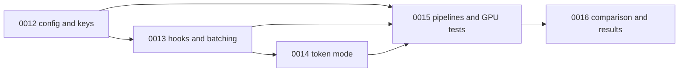

# Wave 1: Batched and Per-Token Fisher Estimation

- Status: Proposed
- Date: 2026-09-29
- Related ADRs: [0003](../../adr/0003-fisher-weighted-kmeans-methodology.md), [0005](../../adr/0005-artifact-format-and-simulated-inference.md), [0008](../../adr/0008-batched-and-per-token-fisher.md)

Wave 1 implements ADR 0008. It makes the Fisher estimator configurable, adds the per-token empirical Fisher, and measures whether its lower sampling noise changes the quantized model's answer quality. The results go into `results.md` in this directory, written by spec 0016 and laid out like wave 0's [results](../wave_0/results.md).

## Scope

The wave changes only the Fisher stage and what depends on its cache key. The k-means, artifact format, inference, and metrics from wave 0 are reused unchanged.

| Area | In wave 1 | Out of scope (later waves) |
| --- | --- | --- |
| Configuration | The `fisher` Hydra group and `FisherConfig`; the Fisher key gains `granularity` and `positions_per_sequence` | Sampled labels (the true Fisher) |
| Fisher estimation | Per-item gradient hooks; sequence mode with `batch_size > 1`; token mode with `prefix_batch` and `batched_backward`; position subsampling; split-half stability | A sliced, checkpointed LM head for larger sequence batches |
| Artifacts | Fisher schema version 2; the manifest records the estimator, split-half correlations and peak GPU memory | Bitplane packing |
| Pipelines | `run_quantization` dispatches on `fisher`; `quantize_summary.json` records peak GPU memory per stage | The quantize-summary fixes on the reuse path from the wave 0 review |
| Evaluation | The wave 0 acceptance rerun; incremental evaluation of two token-mode Fishers; a comparison script and `results.md` | `lm-eval` tasks, generations, LLM-as-a-judge (ADR 0007) |

## Specs

Numbering continues from wave 0. Each spec gives its files, interfaces, algorithm and verification, in wave 0's format.

| Spec | Title | Covers | Depends on |
| --- | --- | --- | --- |
| [0012](0012-fisher-configuration-and-keys.md) | Fisher configuration, keys and manifest | `FisherConfig`, the Hydra group, Fisher schema version 2, the manifest's new fields | wave 0 |
| [0013](0013-item-gradient-hooks-and-batched-sequences.md) | Per-item gradient hooks and batched sequence mode | The accumulator with split halves, `item_gradient_hooks`, `estimate_fisher` dispatch, sequence batches | 0012 |
| [0014](0014-token-mode-fisher.md) | Token-mode Fisher | `prefix_batch`, `batched_backward`, the capability check, position subsampling | 0013 |
| [0015](0015-pipeline-wiring-and-integration-tests.md) | Pipeline wiring and integration tests | `run_quantization` and `run_evaluation` changes, peak memory, GPU equivalence tests on Granite | 0012–0014 |
| [0016](0016-comparison-run-and-results.md) | Comparison run and results | The run matrix, the regression gate against wave 0, `compare_fishers.py`, `results.md` | 0015 |

*Arrows point from a spec to the specs that build on it. Each spec's unit tests land in the same step as its code.*

## Implementation order

Each step leaves the offline suite green, and the default path keeps wave 0's behaviour until step 5 checks it on the GPU. When a step lands, its specs' status moves from Proposed to Implemented, and this index's status moves once the definition of done passes.

1. Configuration, keys and manifest (spec 0012), with every `fisher_key` and `fisher_snapshot` caller updated. The default estimator still runs ADR 0003's loop.
2. The accumulator, the per-item gradient hooks, and batched sequence mode (spec 0013), tested against the default path on the tiny model.
3. Token mode (spec 0014), tested against one `torch.autograd.grad` per token on the tiny model.
4. Pipeline wiring and peak memory (spec 0015), then the GPU integration tests on Granite.
5. The comparison run (spec 0016). First the wave 0 acceptance rerun and its regression check, then the two token-mode Fishers, then `compare_fishers.py` and `results.md`.

## Definition of done

The wave's gate is correctness, not improvement. It passes whether or not token mode beats the sequence Fisher, as long as the comparison is sound and reported.

- `ruff format --check .`, `ruff check .`, and `pyright` (strict) pass with no errors.
- `pytest --cov=anyprec --cov-fail-under=70` passes offline without a GPU, including every equivalence test in specs 0013 and 0014.
- `pytest -m "gpu or network or slow"` passes, including the Granite equivalence tests of spec 0015.
- The default config's full quantize and evaluate run passes `evaluation/check_acceptance.py` unchanged, and its metrics are within the regression tolerances of spec 0016.
- Both token-mode runs complete, and `results.md` reports every section spec 0016 lists.

## ADR details the specs depend on

These ADR 0008 decisions shape several specs at once. They are listed here so a reviewer can check the specs against the right section.

| ADR | Detail | Used by |
| --- | --- | --- |
| 0008 | Only `granularity` and `positions_per_sequence` enter the Fisher key; `token_method`, `batch_size` and `split_half` are recorded in the manifest only | 0012, 0015, 0016 |
| 0008 | Target weights stay frozen on every non-default path; a forward hook on the input embedding gives layer outputs a gradient path | 0013, 0014 |
| 0008 | `batched_backward` fails loudly through `FisherCapabilityError`, with no silent fallback | 0014, 0015 |
| 0008 | Sequence and token Fishers differ by a constant scale, so they are compared by rank, never mixed | 0012, 0016 |
| 0008 | Split halves are routed by the parity of the calibration sequence, and their Spearman correlations are recorded but not the halves | 0013, 0016 |
| 0003 | The default estimator (`sequence`, `batch_size: 1`) keeps the post-accumulate hook, so wave 0's numbers are reproduced | 0013, 0016 |
